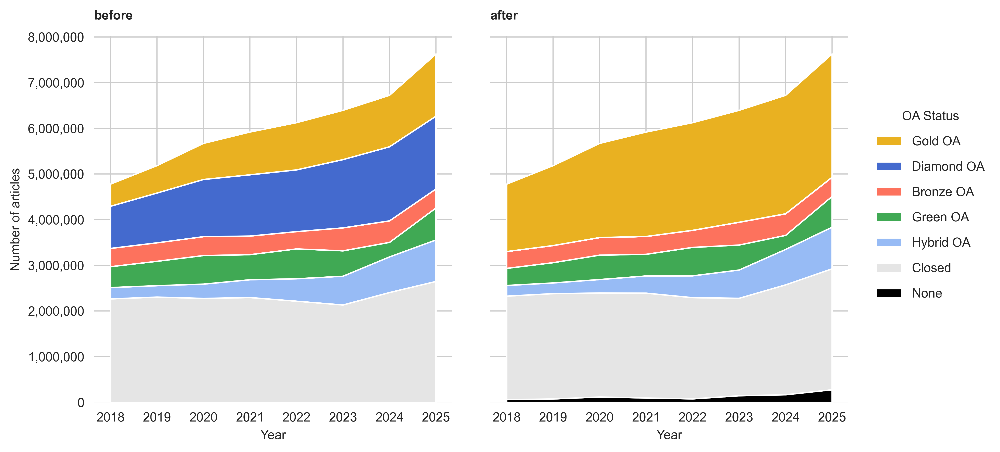

# Open Access classification issues in Walden

Inconsistencies in the OA-Classification:

- oa_status = 'closed', but best_oa.is_oa = True
- oa_status = 'green', but best_oa.source = 'journal'
- oa_status = 'diamond', but apc = None
- oa_status = 'hybrid', but license = None
- source_type = None

Code OA-Classification OpenAlex: https://github.com/ourresearch/openalex-guts/blob/main/models/work.py

Code OA-Classification Walden: https://github.com/ourresearch/openalex-walden/blob/main/notebooks/end2end/CreateWorksEnriched.ipynb

## Method

Creating a table to reclassify the OA status following this approach: https://help.openalex.org/hc/en-us/articles/24347035046295-Open-Access-OA

```sql
CREATE OR REPLACE TABLE subugoe-collaborative.resources.walden_oa_articles_18_25 AS (
        SELECT id, 
               doi,
               best_oa_location.is_oa AS best_oa_location_is_oa, 
               best_oa_location.source.is_oa AS best_oa_location_source_is_oa, 
               best_oa_location.license AS best_oa_location_license, 
               best_oa_location.source.type AS best_oa_location_source_type, 
               best_oa_location.source.host_organization_name AS best_oa_location_source_host_organization_name, 
               best_oa_location.pdf_url AS best_oa_location_pdf_url,
               best_oa_location.source.is_in_doaj AS best_oa_location_source_is_in_doaj,
               apc_list.value_usd AS apc_list_value_usd, 
               apc_list.value AS apc_list_value, 
               open_access.is_oa AS original_is_oa,
               open_access.oa_status AS original_oa_status, 
               publication_year
               FROM `subugoe-collaborative.openalex_walden.works`
               WHERE type IN ('article', 'review') 
                AND is_xpac=False 
                AND is_paratext=False 
                AND is_retracted=False
                AND publication_year BETWEEN 2018 AND 2025
)
```

## Result

<figure>
    
    <figcaption>
        <b>Fig.1:</b> Open Access before and after the reclassification.
    </figcaption>
</figure>